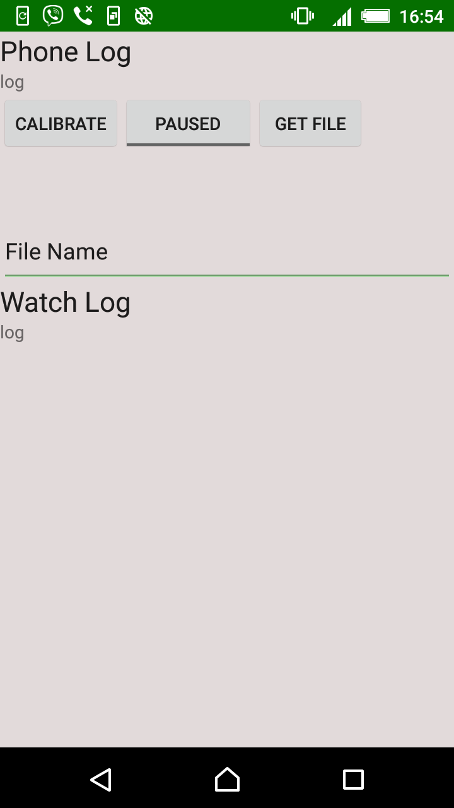

This is an android app for storing accelerometer data from an Android smartwatch.
To use the app :

Connect the smartwatch to your phone.

Pressing the "paused" button starts to records acceleration data from the smartwatch.

Pressing this button again stoppes recording.

log shows how long was the data recorded for.

Press "get file" to retrieve the data files (.csv format) to your phone.

If the file transfer is complete, the log displays file size.

